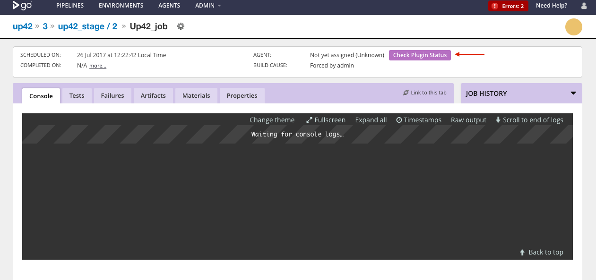

# GoCD Microsoft Azure Elastic Agent Plugin

This [Elastic Agent](https://docs.gocd.org/current/configuration/elastic_agents.html) plugin for *[Microsoft Azure](https://azure.microsoft.com/)* allows you to run elastic agents on Windows Azure virtual machines.
The plugin takes care of spinning up, shutting down virtual machines and installing go-agent based on the need of your deployment pipeline, thus removing bottlenecks and reducing the cost of your agent infrastructure. The plugin, based on the user-defined configuration, decides whether to spin up a new virtual machine or re-use an existing one.

The plugin can be configured to use a Azure virtual network, resource group and region where the virtual machines will be created. It supports both **Windows** and **Linux** virtual machines. The elastic profiles can be configured to use an image from Azure marketplace or a custom image from your subscription along with the size of the VM, disk space and more.

Once the builds finish, the virtual machine will be terminated or kept idle for a configured amount of time. This allows for more efficient usage of resources and reduces the overhead of creating virtual machines for each job. The VM will be terminated after the idle time and a fresh one will be created once required by a new job.

Table of Contents
=================

  * [Building the code base](#building-the-code-base)
  * [Install and configure the plugin](/INSTALL.md)
  * [Troubleshooting](#troubleshooting)

## Building the code base

To build the jar, run `./gradlew clean test assemble`

## Troubleshooting

## Status Report

The Plugin Status report gives a quick overview of the virtual machines. The status report lists the various virtual machines created. The report also lists the errors and warnings to quickly troubleshoot issues.

<hr/>

### Accessing the Azure Plugin **Status Report** (for admins only)
You can access the status report from two places -

1. **Directly from the plugin settings page:**

  

2. **From the job details page:**

  


## Enable Logs

### If you are on GoCD version 19.6 and above:

Edit the file `wrapper-properties.conf` on your GoCD server and add the following options. The location of the `wrapper-properties.conf` can be found in the [installation documentation](https://docs.gocd.org/current/installation/installing_go_server.html) of the GoCD server.

 ```properties
# We recommend that you begin with the index `100` and increment the index for each system property
wrapper.java.additional.100=-Dplugin.com.thoughtworks.gocd.elastic-agent.azure.log.level=debug
```

If you're running with GoCD server 19.6 and above on docker using one of the supported GoCD server images, set the environment variable `GOCD_SERVER_JVM_OPTIONS`:

 ```shell
docker run -e "GOCD_SERVER_JVM_OPTIONS=-Dplugin.com.thoughtworks.gocd.elastic-agent.azure.log.level=debug" ...
```

---

### If you are on GoCD version 19.5 and lower:

* **On Linux:**

    Enabling debug level logging can help you troubleshoot an issue with this plugin. To enable debug level logs, edit the file `/etc/default/go-server` (for Linux) to add:

    ```shell
    export GO_SERVER_SYSTEM_PROPERTIES="$GO_SERVER_SYSTEM_PROPERTIES -Dplugin.com.thoughtworks.gocd.elastic-agent.azure.log.level=debug"
    ```

    If you're running the server via `./server.sh` script:

    ```shell
    $ GO_SERVER_SYSTEM_PROPERTIES="-Dplugin.com.thoughtworks.gocd.elastic-agent.azure.log.level=debug" ./server.sh
    ```

    The logs will be available under `/var/log/go-server`

* **On windows:**

    Edit the file `config/wrapper-properties.conf` inside the GoCD Server installation directory (typically `C:\Program Files\Go Server`):

    ```
    # config/wrapper-properties.conf
    # since the last "wrapper.java.additional" index is 15, we use the next available index.
    wrapper.java.additional.16=-Dplugin.com.thoughtworks.gocd.elastic-agent.azure.log.level=debug
    ```

    The logs will be available under the `logs` folder in the GoCD server installation directory.

## License

```plain
Copyright 2020 ThoughtWorks, Inc.

Licensed under the Apache License, Version 2.0 (the "License");
you may not use this file except in compliance with the License.
You may obtain a copy of the License at

    http://www.apache.org/licenses/LICENSE-2.0

Unless required by applicable law or agreed to in writing, software
distributed under the License is distributed on an "AS IS" BASIS,
WITHOUT WARRANTIES OR CONDITIONS OF ANY KIND, either express or implied.
See the License for the specific language governing permissions and
limitations under the License.
```
